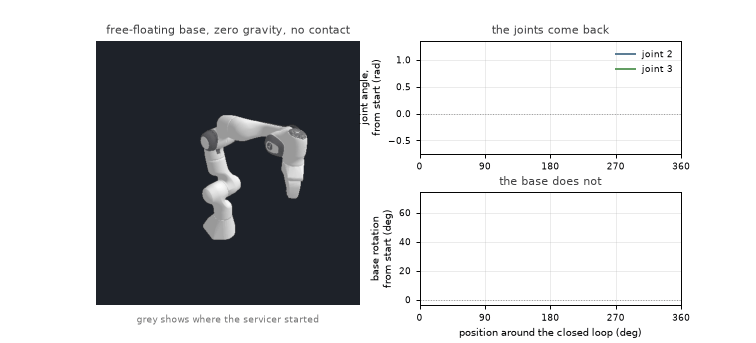
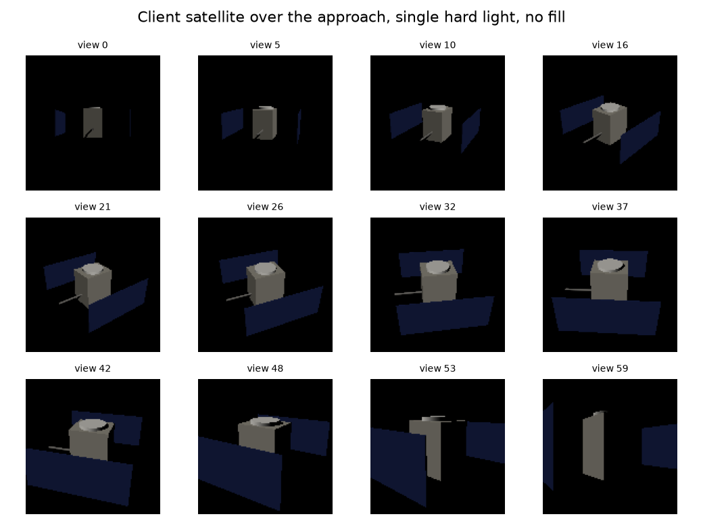
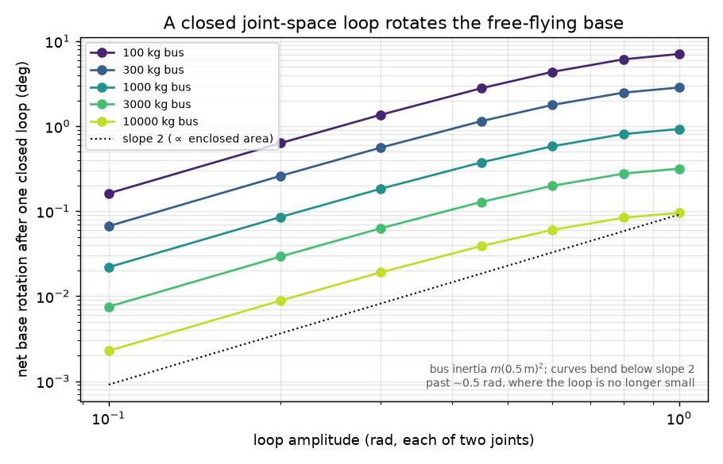
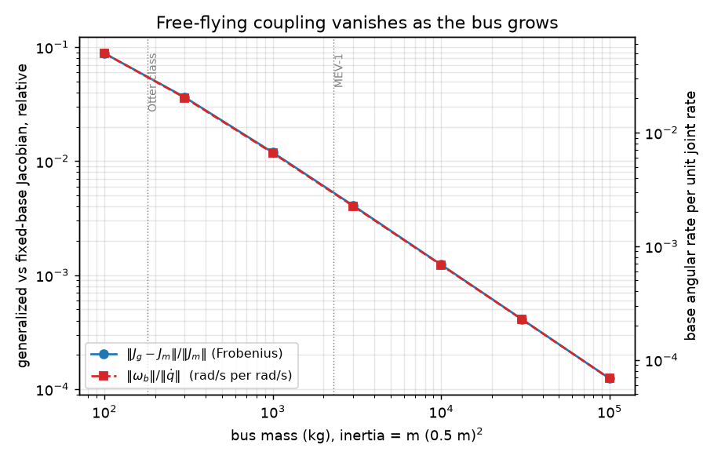
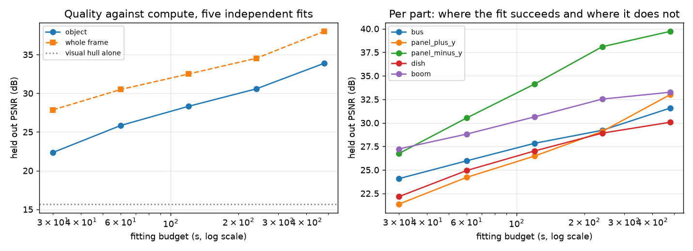
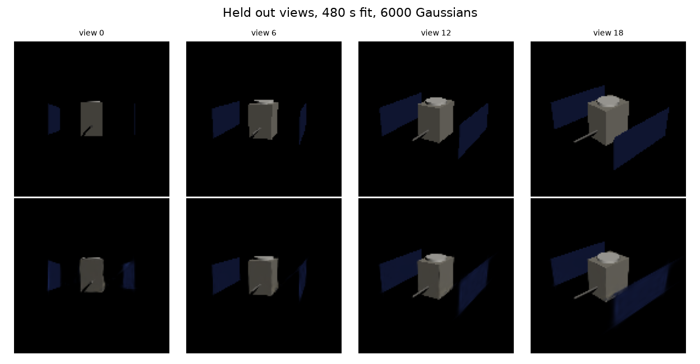

# free-floating-manipulation

Manipulation planning for an arm on an uncontrolled free floating base, with on orbit satellite servicing as the driving case: a servicer with its thrusters off and its wheels idle, moving its arm toward a target it has not yet grappled. A fixed base arm pushes against the world for free, because every reaction torque a joint generates is absorbed by the floor. Take the floor away and the reaction has nowhere to go but the spacecraft, so the base translates and rotates in response to every joint motion and base attitude ends up depending on the entire history of arm motion rather than on where the joints currently are.



Two joints trace a circle in joint space and come back to the angles they started at, to within 4.71e-04 rad. The base does not come back. The consequence is not a correction term: the map from configuration to end effector pose stops being a function of configuration at all, because two paths that start and end at the same seven joint angles put the gripper in two different places. Every fixed base planner assumes that map exists. This repository builds the objects that replace it, measures how large the effect is, and builds the whole thing a second time in C++ to find out what the first version had got wrong. Then it goes one step further out, because a servicer does not have drawings of its client either: it reconstructs the target from approach imagery, tracks pose against the model it built, and runs the result as a mission that can tell you it succeeded while being a hundred and eighty degrees wrong.

## What is here

**Differentiable forward kinematics.** An analytic chain in torch, with the Jacobian through autograd. PyBullet already computes forward kinematics, but it returns a number with no gradient attached, and every Cartesian objective downstream needs to know which way to move. Joint origins are read from the URDF, which states them relative to the parent link frame. That is not a stylistic choice and the reason is under Bugs.

**The floating base mass matrix and coupling inertia.** With zero initial momentum and no external wrench the base twist is pinned at every instant by the joint rates:

```
H_b v_b + H_bm qdot = 0        →        v_b = -H_b^-1 H_bm qdot
```

H_b is the six by six locked inertia of the whole system about the base and H_bm the six by seven block coupling arm motion into base motion, both partitions of

```
M(q) = sum_i [ m_i Jt_i^T Jt_i + Jr_i^T (R_i I_i R_i^T) Jr_i ]
```

summed over every link's centre of mass Jacobian. Inertia enters as a full tensor, not three principal moments, because the model this runs on has genuinely non-diagonal ones. It is built in torch and stays differentiable in q.

**The generalized Jacobian.** End effector velocity on a fixed base is J_m qdot. On a free base it picks up the base reaction, and substituting the line above gives the object a planner works against, which is Umetani and Yoshida, 1989:

```
xdot = J_m qdot + J_b v_b = ( J_m - J_b H_b^-1 H_bm ) qdot = J_g qdot
```

J_m is pure geometry: link lengths and joint axes. J_g contains H_b^-1 H_bm, so it depends on the mass distribution, and two arms with identical link geometry and different link masses reach different places from the same joint trajectory. J_g is also not the derivative of anything. If it were, integrating it around a closed loop in joint space would return exactly zero net base motion, because that is what integrating an exact differential around a closed path does. The measurement below says 18.98 degrees.

**A second implementation, in C++.** The same objects again, in Eigen, reading the model through MoveIt's RobotModel rather than PyBullet. It exists to disagree with the first one, and it did.

**The model is Franka's published identified parameters**, not the Panda URDF that ships with PyBullet, whose declared inertia is a placeholder. Total mass 17.5869 kg, of which the base link is 0.6298 kg.

**A 3D Gaussian splatting implementation, written rather than imported.** A servicer arrives with imagery and no drawings, so the model of the client has to be built from what it can see. The forward pass is projection, depth sort and alpha compositing in torch, differentiable end to end. It is written because no usable implementation could be a dependency here: OpenSplat is AGPLv3 and its copyleft would reach this repository, the INRIA reference is CUDA only and licensed for research and non-commercial use, and gsplat's licence is fine but its ROCm path does not support this machine's card. Licensing is the first argument and not the strongest one. A dependency removes the part worth doing and leaves nothing to disagree with, which is how every real bug in this project was found.

```
A   the 2D covariance against the exact marginal, orthographic   0.000e+00
B   the perspective Jacobian against central differences         2.503e-09 px/m
C0  the closed form line integral against numerical              5.069e-12
D   front to back compositing against an independent back to front  2.220e-16
E   gradients against central differences, all five groups       6.688e-08
```

**A volume renderer built only to disagree with it.** Layer C above: the same Gaussians rendered by brute force ray marching through a genuine 3D density field, sharing no code and no derivation with the splatting path. It is read as a regime table rather than asserted, because a splatting forward pass is not an exact volume renderer and the table measures how far apart the two are and why.

**A reconstruction of the client from approach imagery alone.** 6000 Gaussians placed on a visual hull carved from silhouettes and known camera poses, 11,839 voxels at 128 cubed. The fitting path never reads the target's definition; the only quantity from outside the images is a bounding box that follows from the approach range and the field of view.



Sixty views closing from 9.0 to 4.2 m over a 150 degree sweep, with elevation rising and falling so the views are not coplanar. One hard directional light and no ambient, because that is what orbit provides and it is harder for it.

**Pose tracking on two losses, because neither alone is a tracker.** Photometric registration acquires from a cold start and cannot hold a long window. Silhouette registration holds indefinitely and cannot acquire at all. Both failures trace to the same cause, and that is the most useful thing the second half of this project produced.

**A Gazebo scene and a ROS 2 mission executive.** Gazebo renders and hosts the topics; it computes no physics, because the dynamics are already verified and handing them to a second solver would mean either trusting it unchecked or spending a phase revalidating numbers that are in hand. A BehaviorTree.CPP tree sequences acquisition, verification, planning, the free floating trajectory check and execution.

**An auditor that does not believe the executive.** A separate node comparing ground truth against the pose the mission published, never subscribed to anything the tree says about itself. A behavior tree returning SUCCESS is the same class of claim as a simulator service returning true, and the audit exists because that claim turned out to be worth exactly as little.

Everything is checked against exact references rather than against each other.

| quantity | checked against | agreement |
| --- | --- | --- |
| forward kinematics | getLinkState, 500 configurations | 0.000107 mm, 4.7e-07 on rotation |
| link centre of mass Jacobians | calculateJacobian, per link | 2.1e-15 |
| M symmetry | its own transpose | 8.9e-16 |
| translational block of M | total mass times identity | exact |
| H_m, the arm block | free and fixed base calculateMassMatrix | 1.1e-10 |
| H_b and H_bm | free base calculateMassMatrix | 5.7e-09 |
| J_m | calculateJacobian, fixed base | 1.7e-15 |
| J_g qdot | zero gravity free floating simulation | 1.0e-04 relative |
| minus H_b^-1 H_bm qdot | measured base twist in simulation | 1.1e-04 relative |
| every block | the independent C++ implementation | 3.6e-15 |
| M and J_g gradients | central differences | 2.1e-09 |

The 5.7e-09 on H_b is not our floor. PyBullet stores an inertia tensor as principal moments plus the rotation that diagonalises them, so a tensor with off diagonal terms only survives the round trip as well as its eigensolve does, which is 5.802e-09 on this model. The tolerance is derived from that measurement rather than set as a constant.

J_g has no reference implementation anywhere, so it is validated three ways that do not share a failure mode: against a simulation, against the large bus limit where it must collapse back to J_m, and against the C++ port.

## Results

### A closed loop in joint space leaves the base rotated

Two joints trace a circle of amplitude 0.6 rad over 2 s and come back to their starting angles. The loop does not close exactly: position control leaves a residual of 4.71e-04 rad on the worst joint, which is worth stating rather than rounding to zero. On a fixed base the arm would be back where it started. On the 17.59 kg free floating servicer it ends 18.9798 degrees rotated, which is 0.331 rad, about an axis of [-0.071, 0.006, -0.323]. The base swings well past that during the loop and comes most of the way back, but not all of it.

The residual is about 700 times smaller than the rotation it would have to explain, so it cannot account for the result, and it behaves differently under refinement. Halving the timestep halves the residual, 3.77e-03 then 1.89e-03 then 9.42e-04 then 4.71e-04, which is first order and heading to zero. The rotation over the same refinement goes 18.9670, 18.9742, 18.9779, 18.9798, converging on a value that is not zero. A rotation caused by the loop failing to close would follow the residual down.

That is the whole claim in one number, so the work is in showing it is physics and not the integrator sliding.

| evidence | result |
| --- | --- |
| Timestep independence | the rotation converges on 18.982 degrees as dt halves from 2e-3 to 1.25e-4, with the increments shrinking each time. Coarse to fine spans 0.07 percent. |
| Sign reversal | backward traversal gives 18.9890 degrees about the exactly opposite axis, alignment minus 1.000. Composing the two lands 0.0131 degrees from the identity, against 18.98 for one loop. Drift accumulates the same way in either direction; a geometric phase cancels. |
| Independent integration | RK4 integration of omega_b = [-H_b^-1 H_bm qdot]_ang around the same path gives 18.9823 degrees against the simulation's 18.9808, a gap of 0.01 percent, sharing no code with it. |
| Momentum conservation | peak total momentum along the loop is 6.37e-03 of its own scale at dt = 1e-3 and 1.59e-03 at 2.5e-4, falling by 4.0x for a 4x smaller step, so it is the stepper and not a leak. |

Three of those four are arguments a wrong answer could not survive, and they fail in different ways. Timestep refinement catches an integrator artifact. Sign reversal catches anything that accumulates rather than closing. The RK4 comparison catches an error in the simulation rather than in the model.

### The same loop on two different robots

The number depends on the model, and how much is worth being explicit about. Run the identical loop on PyBullet's Panda, whose inertias it derives from the collision meshes because the file's declared values are a placeholder, and the base ends 10.02 degrees rotated. Run it on Franka's published identified parameters and it ends 18.98. Link 1 alone is 2.70 kg on the first and 4.97 kg on the second, and the identified model puts much more mass outboard.

So the magnitude of the effect depends strongly on the mass distribution, which is what the theory says it should: J_g contains H_b^-1 H_bm, and that is exactly a statement about where the mass is. What does not change is everything structural.

| | PyBullet, mesh derived | Franka, identified |
| --- | --- | --- |
| net base rotation | 10.0238 deg | 18.9798 deg |
| link 1 mass | 2.70 kg | 4.97 kg |
| timestep independence | converges, 0.43 percent spread | converges, 0.07 percent spread |
| sign reversal, axis alignment | minus 1.000 | minus 1.000 |
| composed forward and backward | 0.0058 deg | 0.0131 deg |
| analytic RK4 vs simulation | 0.02 percent | 0.01 percent |
| amplitude slope | 1.94 | 1.94 |
| bus inertia slope | minus 0.99 | minus 0.98 |

That matters more than either number. A result that reproduces across two different mass distributions is evidence that the phenomenon is real rather than an artifact of one model's parameters, and the two here are not small perturbations of each other: the masses differ by a factor of two on individual links and the inertia tensors are diagonal in one and not in the other. The nonholonomy survives that unchanged in every respect except its size, and its size moves in the direction and roughly the proportion the mass change predicts.

The identified parameters are canonical for the same reason they are more useful: they are the ones Franka published for the real arm, and the other set is a placeholder in the file plus whatever PyBullet inferred from mesh geometry. Both are kept, and every script and test runs against either, because a suite that only ever sees one model cannot tell a convention from a coincidence. Three of the six bugs below were found exactly that way.

### How large the effect is, across buses



Net base rotation after one closed loop. Bus inertia is modelled as I = m (0.5 m)^2, a metre scale spacecraft rather than the Panda's dense pedestal, so the bus dominates the arm's own contribution. Small loops follow a log log slope of 1.94 in amplitude, tracking the enclosed area, and minus 0.98 in bus mass. The curves bend below slope 2 past about 0.5 rad, where the loop stops being small, and that limit is on the figure rather than cropped out of it.

A 2,300 kg servicer of roughly MEV-1 scale still turns about a quarter of a degree per loop at 0.6 rad amplitude. That is small, and it accumulates over every loop of a real task, in a direction that depends on the path taken.



The same limit seen through the Jacobian. The relative difference between J_g and J_m falls on a log log slope of minus 0.996 across five decades of bus mass. A heavy enough bus makes the free flyer a fixed base again, and J_g degrades gracefully into J_m rather than being a separate regime, which is the sanity property a formulation like this ought to have.

### What a fixed base planner misses, and when it matters

A planner that holds the base still is answering a different question from the one a free flyer needs answered. `ws/` carries a C++ component that walks an arm trajectory, integrates the base motion the dynamics imply, writes the result into the SRDF floating joint, and re-checks every state against the MoveIt planning scene.

The demonstration is a 200 kg servicer reaching out from a folded pose to a grapple fixture beyond a piece of target structure. OMPL plans it in the ordinary way and MoveIt certifies the result. OMPL is randomised and returns a different path on every call, so what follows is the modal draw rather than a run: 24 of 40 plans leave exactly this clearance. A single draw of a randomised planner is a sample, and the two ways a plan fails here fail differently, so quoting one draw as the result would misrepresent the system. Both halves of the modal case are the result:

```
the modal plan, the clearance 24 of 40 draws leave
MoveIt's own verdict on it:            collision free
clearance to the world, base fixed:    17.3 mm
clearance to the world, base free:     -0.8 mm   (panda_link6 to target_structure)
margin consumed by base reaction:      18.2 mm
base motion over the path:             2.645 deg, 20.7 mm
  base held fixed       no collision
  base free to react    COLLIDES, 0.81 mm penetration, panda_link6 against target_structure
```

That case is marginal rather than emphatic, and it should be: across the 24 modal draws the free clearance has a median of -0.3 mm and 14 of them collide. The reaction and the margin are the same size, so which side of zero a given plan lands on is close to a coin toss.

The other failure mode is the tail, and it is a different thing. OMPL occasionally returns a path that leaves under a millimetre to begin with: one draw here left 0.8 mm and ended 1.57 mm into the structure on `panda_link5`. That mode barely involves the dynamics. Even a 2,300 kg servicer consumes 1.7 mm on this trajectory, which is more than such a plan has, so it fails at every bus mass in the table below. Keeping the two apart is what that table's last column is for.

**The hazard is not that the base moves. It is that the base moves by more than the planner happened to leave.** Over 40 independent plans on the identical query at 200 kg, every one of them collision free with the base held still, the margin the base reaction consumes has a median of 16.8 mm and a middle half of 13.7 to 18.5. The clearance OMPL leaves has the same median, 17.3 mm, but a middle half of 11.8 to 17.3 and a tail reaching down to 0.6 mm. Thirty of the forty collide. What decides the outcome is the planner, not the dynamics: the reaction is about the size of the entire margin an ordinary plan leaves, so whether a given plan survives turns on how much clearance OMPL happened to return. Two of the forty consumed more than 30 mm, where OMPL returned an unusually long path.

That is also why the effect cannot be provoked by asking for a larger motion. Widening the trajectory made OMPL route further from the structure, and the clearance it returned went from 17.3 mm to 63.5 and then 133.6 mm: a planner with room uses it, and nothing happens. **The hazard lives in constrained passages**, where the planner has no margin to spare, and that is precisely where a base aware check earns its place.

The binding link is `panda_link6` in most draws and `panda_link5` in the rest, never the end effector. The reason is not that it sits closer to the base. Measured along this path, `panda_link6` and `panda_hand` are 638 and 583 mm from the base at the start and 929 and 905 mm at the goal, within 3 to 9 percent of each other throughout, so distance from the base does not separate them. What makes an estimate taken at the end effector overstate the danger is that base displacement is an upper bound on margin loss rather than a measure of it: only the component normal to the obstacle face consumes clearance and the rest is motion along it. At 500 kg the base moves 1.248 deg and 9.0 mm over the path, which sweeps roughly 20 mm at link 6, while the margin actually consumed there is 7.7 mm. Which link supplies the minimum is a geometric question the dynamics cannot answer, which is why the check is run against the scene rather than estimated off the base twist.

How much of this survives depends on the servicer. Forty plans at each bus mass, on the same scene and the same query, every one of them collision free with the base held still:

| bus mass | margin consumed, median | plans colliding | of the plans OMPL left at 17.3 mm |
| --- | --- | --- | --- |
| 2300 kg, MEV-1 class | 1.7 mm | 8 of 40 | 0 of 20 |
| 1000 kg | 3.8 mm | 10 of 40 | 0 of 19 |
| 500 kg | 7.7 mm | 8 of 40 | 0 of 21 |
| 300 kg | 12.1 mm | 9 of 40 | 0 of 23 |
| 250 kg | 14.6 mm | 17 of 40 | 1 of 18 |
| 200 kg, ELSA-d class | 16.8 mm | 30 of 40 | 14 of 24 |
| 150 kg | 18.8 mm | 37 of 40 | 17 of 20 |

The consumed margin is the physics, and it is monotone across the whole range because the dynamics set it once a path is given. The collision rate is not. It tracks bus mass down to about 250 kg and then flattens at 8 to 10 in 40, which is not a floor in the dynamics but planner scatter: OMPL leaves its modal 17.3 mm on a majority of draws, its tail reaches 0.1 mm, and a path with nothing to spare collides at any bus mass. Above 300 kg not one of the modal plans collides, so every remaining failure comes from that tail rather than from base reaction being large.

The crossing is a prediction rather than a description of the data. The reaction eats the modal 17.3 mm below about 250 kg and does not above it, so the modal plans ought to go from mostly failing to not failing across that row. The 250 kg row was run after the others to test exactly that, and it landed where the consumed margin said it would: 1 of 18 modal plans, against 14 of 24 at 200 kg and none at 300.

An earlier version of this table reported collision rates alone and was monotone across all six masses, at 4, 6, 7, 13, 32 and 35 of 40 from 2300 kg down to 150. That table was not reproducible. Rerunning the same command gives 8, 10, 8, 9, 30 and 37, flat above 300 kg rather than monotone. The variance at n = 40 is several plans wide and the monotone version was one draw of it. Raising the sample from 12 to 40 had removed a visible inversion between two rows without removing what caused it, which is that the collision rate stops depending on bus mass once the reaction is smaller than the margin a typical plan leaves. The consumed margin column reproduces because it does not depend on which path came back.

So this is a real hazard for a servicer of a few hundred kilograms and a marginal one for a heavy bus, on an ordinary planning clearance rather than a contrived one. It never falls to zero, because OMPL sometimes returns a path with almost no margin and that fails at any mass. What bus mass changes is whether an ordinary plan is at risk at all.

One caveat on reproducibility. OMPL is not seedable through MoveIt's interface here: seeding `ompl::RNG` before the planner plugin loads and forcing a single planning attempt still returns 33, 16 and 22 waypoint paths for the same seed. The seed argument is kept and documented as insufficient rather than removed, and the distribution is reported rather than any single run, because reporting one run of a randomised planner would be selection.

### Building a model of a target nobody has drawings of

A servicer arrives with imagery. The reconstruction has to come from that, so the fit is reported as a curve of quality against compute rather than as a best result: what matters is not the number reached but what another doubling would have bought.



Six independent fits, each with a schedule sized to its own budget, so every row is what that much compute actually buys rather than a checkpoint of a longer run under a schedule it never had.

| budget | steps | object | whole frame | per doubling |
| --- | --- | --- | --- | --- |
| the visual hull alone | 0 | 15.68 dB | | |
| 30 s | 433 | 22.36 dB | 27.86 dB | |
| 60 s | 815 | 25.85 dB | 30.50 dB | +3.49 |
| 120 s | 1533 | 28.32 dB | 32.49 dB | +2.47 |
| 240 s | 2863 | 30.58 dB | 34.52 dB | +2.26 |
| 480 s | 4926 | 33.88 dB | 37.99 dB | +3.30 |
| 960 s | 10030 | 34.46 dB | 38.72 dB | +0.58 |

The 960 s row exists because the first five did not turn over. A curve still linear in log time cannot say what a longer run would give, which is the only reason to draw one, so one sixteen minute run was spent settling it.

Reading the last column needs the noise, and measuring it changed two conclusions. Four repeat draws at 240 s span 29.48 to 31.30 dB with a standard deviation of 0.75, so a difference between two budgets carries about 1.06 dB. That retires the apparent dip at +2.26 followed by +3.30, which is 1.04 dB and inside one standard deviation, and it downgrades the collapse to +0.58 from a plateau to a suggestion at about 2.6 standard deviations. Without the repeats the first would have looked like a real dip and the second like a real ceiling.

Quality is reported over the object rather than the whole frame. The target covers 23.9 percent of the image and the rest is black, so the frame number flatters every row by about 5 dB and mostly measures how well black is reproduced.



Per part scores are recorded and are confounded, which is worth saying rather than presenting them bare. The boom reaches 33.25 dB at 480 s, above the bus and the dish, and that is not evidence it was resolved better: it is small, dim and nearly uniform, which is easy in mean squared error. The slope carries the information. Over the last doubling the dish gains 0.70 dB and the boom 0.80 while the bus gains 1.06, and the dish ends lowest in absolute terms at 30.76 dB while flattening. The dish and the boom are the capacity limits, and the dish is arguably the worse of the two.

### Tracking the target takes two losses, and each one's blind spot is the other's strength

Photometric registration acquires from a cold start and cannot hold a long window. Silhouette registration holds indefinitely and cannot acquire at all. Neither alone is a tracker, and both failures have the same cause.

The fitted model has the approach lighting baked into it. During the approach the sun was fixed in the world and the camera orbited, so in the target's body frame the light never moved, which is the assumption splatting makes. A tumbling client inverts that: the sun stays fixed and the body turns under it, so in the body frame the light direction moves and the model cannot represent it.

| body frame sun moved | object PSNR | lost | lit pixels changed |
| --- | --- | --- | --- |
| 0 deg | 33.72 dB | the fit's own quality | 0.0% |
| 5 deg | 31.76 dB | 1.95 dB | 10.0% |
| 10 deg | 28.42 dB | 5.30 dB | 19.3% |
| 20 deg | 22.65 dB | 11.07 dB | 36.0% |
| 45 deg | 15.70 dB | 18.02 dB | 70.9% |

That is the whole story of the pairing. Baked lighting is what breaks the 180 degree pose degeneracy of this target, which is why photometric can acquire; and it is what decays as the body turns, which is why photometric cannot hold. Silhouette discards shading, so it is immune to the decay, and for exactly that reason it has nothing left to break the degeneracy with.

So the phase runs two windows. Photometric over 8 s, where the model is still worth something, holds to a worst attitude error of 2.60 degrees and a final 1.34, with no frame past 20 degrees. Its degradation against the body frame sun angle is mild: the median error goes from 0.781 degrees over the first two degrees of sun motion to 1.336 over the last three. Silhouette over the full 48 s holds to a worst of 4.67 degrees and a final of 1.21, again with no frame past 20, while the sun sweeps 49.6 degrees.

**A prediction curve that had to be thrown away.** A filter is graded on how far ahead it can predict, not on how well it tracks the current frame, because the mission quantity is where the grapple fixture will be on arrival. The first grading said that integrating Euler's equations beat assuming a constant body rate by +0.01 to +0.54 degrees at a sixteen second lead. Essentially nothing, and the tempting conclusion is that tri-axial dynamics do not matter over that horizon.

They were not being measured. The body rate came from a two frame difference of attitude estimates carrying a degree or two of error over a half second step, giving a rate error of 0.973 deg/s against a true rate of 2.7. Nothing downstream of an estimate with that signal to noise can depend on the propagator, so the comparison was measuring the rate estimator and reporting it as a fact about rigid body physics.

Smoothing the rate over sixteen frames brings its error to 0.584 deg/s and the picture inverts.

| lead | hold still | constant rate | Euler's equations |
| --- | --- | --- | --- |
| 1.0 s | 4.47 deg | 2.30 deg | 2.30 deg |
| 4.0 s | 12.24 deg | 2.81 deg | 2.66 deg |
| 16.0 s | 43.67 deg | 9.36 deg | **6.62 deg** |

The tri-axial coupling is worth 2.74 degrees at a sixteen second lead, 29 percent, and it is worth nothing at all until the rate estimate is clean enough to show it. The smoothing sweep is reported rather than the best row, because the answer depends on a choice and quoting only the second would hide that.

### Acquiring lock is where more search makes the answer worse

Every tracking result above starts frame zero at the truth. That is not a detail: it means each of them assumes an acquisition step, and this is the test of whether one exists. Forty orientations drawn uniformly over SO(3), a median of 116 and 130 degrees from the truth, each optimised alone with no warm start.

| | photometric | silhouette |
| --- | --- | --- |
| lands in the true basin | 9 of 40, 22% | 7 of 40, 18% |
| lands on the 180 degree flip | 2 of 40, 5% | 8 of 40, 20% |
| lands somewhere else | 29 of 40, 72% | 25 of 40, 62% |
| runs scoring below the best correct run | 0 | 9 |

Per attempt the two are close. Everything turns on that last row, which is whether the loss can rank the answer once a search has found it.

| lowest final loss | photometric | silhouette |
| --- | --- | --- |
| best run in the true basin | 1.1858e-02 | 7.0305e-02 |
| best run on the flip | 2.9932e-02 | 7.7208e-02 |
| best run in some other basin | 1.5647e-02 | **6.8352e-02** |

For the photometric loss the true basin holds the lowest value anywhere, so taking the minimum over restarts converges on the truth. For the silhouette loss the lowest value found anywhere sits in a wrong basin and beats the best correct run. **The global minimum of the silhouette loss is not the true pose**, and the consequence follows mechanically.

| restarts | photometric | silhouette |
| --- | --- | --- |
| 1 | 22% | 18% |
| 2 | 40% | 24% |
| 4 | 64% | 22% |
| 8 | 87% | 11% |
| 16 | 98% | 2% |
| 32 | 100% | 0% |

That column is not a plotting error. Photometric acquisition costs about eight restarts for 87 percent and sixteen for 98, at 120 iterations each. Silhouette acquisition gets monotonically worse with more restarts, because every extra draw is another chance to find a wrong basin that scores better than the right one, and best of k converges on being reliably wrong. Compute spent on it is worse than wasted.

It is the same ordering the flip rejection ratios predicted, 2 to 4x against 1.1 to 1.3x, carried to its conclusion: a loss that barely separates the truth from its alternatives cannot be minimised into the truth.

One pool of forty draws per loss, so a 22 percent rate carries about 6.5 points of binomial sampling error, and the best of k curve is a bootstrap over that pool and inherits it.

### The mission reports SUCCESS and the audit reports 180 degrees wrong

Photometric acquisition handed over to silhouette hold is the composition the two losses imply, and it costs nothing measurable. Over the full 48 s window an acquired pose tracks to a worst of 4.65 degrees against 4.69 for a run started at the truth, identical at the median. An acquisition 10.26 degrees off is pulled back by the tracker itself and ends at the same 1.13 degrees.

The failure mode is total. Handed a flipped pose, the tracker holds it for all 48 seconds at a median error of 175.91 degrees, as smoothly and as confidently as it holds the right one, and nothing in the track reports it.

That leaves the handover as the only moment the error can be caught, and the check is one extra render: evaluate the photometric loss at the acquired pose and at its flip, and keep the lower. Run on deliberately flipped poses, because staying quiet on correct ones is not evidence, it has a hard limit.

| body frame sun | at a correct pose | at a flipped pose |
| --- | --- | --- |
| 0 deg | 3.84x, keep | 0.26x, repair |
| 15 deg | 1.69x, keep | 0.59x, repair |
| 28 deg | 1.00x | 1.00x |
| 40 deg | **0.64x, repair** | 1.55x, keep |

Decisive where the model was fitted, ambiguous by 28 degrees, and inverted beyond it: past 40 degrees the test would repair a correct pose into the flip. It is a handover time check and must never run later, which is the same short window limit the photometric channel has everywhere else in this project, appearing here as a validity bound on a detector rather than as tracking error.

A behavior tree sequences all of it, and a behavior tree returning SUCCESS is the same class of claim as a simulator service returning true. So a separate node compares ground truth against the pose the mission published, and is subscribed to nothing the tree says about itself. It is held to the failure this project documented: a flip injected after verification, where nothing downstream can catch it.

| run | the tree said | the audit said | final attitude error |
| --- | --- | --- | --- |
| nominal | SUCCESS | MISSION CORRECT | 0.852 deg |
| flip injected after verification | SUCCESS | **MISSION WRONG** | **179.557 deg** |

The mutated mission acquired at a loss of 1.159e-02, passed the flip test at 1.93x with the sun 1.9 degrees off, planned 21 waypoints, cleared both the fixed base and free floating collision checks, executed and reported SUCCESS. Every node returned SUCCESS and the mission was 180 degrees wrong.

Building that check found four defects, three of them in the code written to run it: the audit kept state across missions and graded the previous mission's belief, the report was published before the first tracking estimate existed, a read modify write race let a tracking step overwrite the injected flip with a pose derived from the pre-flip belief, and the audit graded missions that never executed. Each of those would have produced a clean pass on a broken mission.

## Bugs found and fixed

Six, and what they have in common is worth naming first. Every one was a silent substitution or an unstated convention that produced a plausible number rather than an error, and not one was found by reading code. Four were found by a second implementation or a second model disagreeing with the first.

### The forward kinematics was verified to 5.7e-08 and wrong

This is the one worth telling. getJointInfo reports a joint's origin relative to the parent link's inertial frame, and the chain composed that offset forward to recover link frames. It agreed with getLinkState to 5.7e-08 over 500 random configurations, which is the number phase 1 shipped on.

It was still wrong. That composition is correct only while every inertial frame is axis aligned with its link frame. It is, on the Panda URDF PyBullet ships: every one of its inertia tensors is diagonal, so PyBullet never has to diagonalise anything, and every inertial rotation is exactly the identity. Point the same chain at a model whose tensors have off diagonal terms, which PyBullet stores as principal moments plus the rotation that diagonalises them, and it is exact through link 1 and 137 mm out at link 2.

Five hundred configurations of a model that cannot express the failure is five hundred configurations of evidence for nothing. The fix is not a better composition, it is to stop depending on the question: joint origins now come from the URDF, which states them relative to the parent link frame and says nothing about inertial frames at all. The regression is a chain built specifically to have rotated inertial frames.

Two more conventions had been pinned on exactly the same insufficient evidence and fell out with it. calculateJacobian's localPosition is in the link's inertial frame, so a centre of mass Jacobian needs R_inertial^T times getDynamicsInfo field 3, not field 3 itself. calculateMassMatrix writes the base twist in the base link's inertial axes, not merely about that point; rotating H_b and H_bm into those axes took the residual from 1.25 down to 5.6e-09. Both reduce to what phase 2 concluded when the rotation is the identity, which on that model it always was.

### A declared inertia that is a placeholder, and a phantom kilogram

Two model faults, both caught by building the C++ port and comparing block by block, neither visible from inside a single implementation.

PyBullet ignores the inertia a URDF declares. By default it derives one from each link's collision geometry, and the file's values are honoured only with URDF_USE_INERTIA_FROM_FILE. The Panda URDF it ships declares ixx = iyy = izz = 0.1 on every single link, a placeholder, so anything that reads that file and believes it gets a physically meaningless robot that still runs. The C++ port read the file and got 0.1 everywhere; the Python read PyBullet and got the mesh derived set. Masses, frames, ancestor sets and both geometric Jacobians agreed to machine precision, and only the inertia dependent blocks disagreed, which is what pointed straight at it.

A link with no inertial block gets mass 1 and a unit inertia rather than zero. panda_link8 is a flange frame and the identified model declares no inertial for it, so PyBullet invents a phantom kilogram in the middle of the arm, warns on stderr, and continues. changeDynamics cannot repair it, because calculateMassMatrix reads load time values, so the fix has to be in the URDF: declare the zero explicitly.

### PyBullet's default link damping, which the API that reports it does not report

Every link gets 0.04 linear and 0.04 angular damping unless told otherwise, and getDynamicsInfo fields 8 and 9 return minus 1.0, meaning unset, whether or not damping is in force, and after changeDynamics has explicitly set them to zero as well. There is no read path.

Damping is an external force, so it violates precisely the assumption the whole derivation rests on. It puts the closed loop base rotation about 2.5 percent below the zero momentum value: large enough to be real, small enough to be blamed on the integrator. The momentum residual barely moves, because at this timestep the stepper's own discretisation error is larger than the leak, so the obvious diagnostic does not detect it. What detects it is comparing the simulation against an independent analytic integration.

### Two robots loaded at one origin

The Jacobian checks need a fixed base reference body and a free base body in the same world. Both were loaded at the origin, they interpenetrated, and the contact solver flung the free one off at end effector speeds of 165 m/s where the correct answer was 0.18. The magnitude is the diagnosis: a modelling error gives a plausible number, a collision gives an absurd one. The fixtures need both bodies at the origin, because the chain builds outward from the base frame and only agrees with getLinkState for a body at the identity, so the reference body's collision mask is cleared instead. It is an oracle, not a physical object.

### Ancestor masking, and what the rewrite actually cost

The link Jacobians were first taken by differentiating the pose through autograd, then replaced with the geometric form for a fourfold speedup. Applied to every arm joint without qualification, that form returns a non zero column for joints distal to a link, claiming that turning joint 5 moves link 1.

The autograd version was structurally immune: differentiating the real chain cannot invent a dependence on a joint the chain does not contain. The bug became possible only when the geometric form began asserting that structure by hand. That is a property of the two implementations, not a latent defect the rewrite uncovered. The rewrite bought speed and paid for it by moving a guarantee out of the representation and into code that has to be right. A per link error table found it in one run, because the proximal links were wrong and the distal ones exact to machine precision, which is not a pattern an aggregate norm would ever show.

## Tests

32 cases across four files, 30 fast and 2 marked slow, each named for the invariant it protects rather than the function it calls: `test_proximal_link_has_zero_columns_for_joints_that_do_not_move_it`, not `test_link_jacobian`. Most exist because of one of the bugs above, which is why this section follows that one. They pass against both models.

A test that cannot fail for a reason you can state is not protecting anything, so each guard was checked by breaking the thing it guards and confirming the case named for it is the one that fails.

| deliberate break | first case to fail |
| --- | --- |
| joint origins read from getJointInfo again | `test_chain_holds_when_the_inertial_frames_are_rotated` |
| ancestor masking removed from the geometric Jacobian | `test_proximal_link_has_zero_columns_for_joints_that_do_not_move_it` |
| damping zeroing made a no op | `test_link_damping_must_be_zeroed_explicitly_not_left_to_the_default` |
| base twist integrated in the world frame | `test_base_twist_integrates_in_the_body_frame_not_the_world_frame` |
| base reference point moved off the base centre of mass | `test_base_inertia_and_coupling_match_free_base_mass_matrix` |
| the base twist layout guard removed | `test_a_swapped_base_twist_layout_is_rejected_not_silently_used` |

Three cases exist to stop others going vacuous. One asserts that some link really is proximal, so the zero columns loop has something to iterate over. One asserts the wrong base reference points genuinely do disagree with PyBullet, so the agreement of the right one is evidence rather than a loose tolerance. And the rotated inertial frame regression asserts that PyBullet really did rotate the frames before testing anything, because a tensor it rejects as unphysical is silently zeroed, which would make that test pass against the very bug it exists to catch.

Tolerances are measured rather than chosen wherever something else sets the floor. The H_b comparison is judged against PyBullet's own eigensolve residual on the same tensors, not against a constant.

## Limitations

Stated rather than softened. Where a method loses is part of the result.

**The Panda is a ground arm standing in for a space manipulator.** Its masses, inertias, reach and joint limits are those of a seven degree of freedom table mounted research arm, now with Franka's published identified parameters rather than a placeholder. The arm to bus inertia ratios swept here are representative of a servicer; the absolute numbers are not, and no conclusion should be transferred to a specific mission from them.

**The bus is a mass and an inertia tensor, not a modelled spacecraft.** No solar panels, no flexible modes, no fuel slosh, no attitude control system. A real servicer would fight base motion with reaction wheels or RCS and would budget propellant to do it. That control problem is exactly what this repository does not address; it quantifies the disturbance such a loop would have to reject.

**There are no contact dynamics at all.** Everything is free motion in free space. Berthing, grappling and the combined body dynamics after capture, which is the part of servicing that actually matters, are absent entirely.

**The fingers are locked.** Their mass rides at its true centre of mass, but they contribute no degrees of freedom, and nothing here models grasping. Lumping that mass onto the hand instead is available and costs 1.08e-02 in H_b, which is measured rather than assumed negligible.

**Zero initial momentum is assumed throughout.** A real target tumbles and a real servicer arrives with residual rates. Every result starts from rest.

**J_g is built, not yet planned with.** The generalized Jacobian and its gradients exist and are verified against every reference available. No planner consumes them yet.

## Requirements

Python 3.10+ and a CPU. No GPU needed; there is no CUDA dependency anywhere, which is deliberate.

The C++ port and the identified model additionally need ROS 2 Jazzy with MoveIt 2 and `moveit_resources_panda_description`, all from the public ROS 2 apt repository. Everything in Python runs without them by setting `FFM_MODEL=pybullet`.

## Setup

```bash
python3 -m venv .venv
source .venv/bin/activate
pip install -r requirements.txt -r requirements-dev.txt
```

The pinned torch build is CPU only and comes from PyTorch's own index:

```bash
pip install torch==2.14.0+cpu --index-url https://download.pytorch.org/whl/cpu
```

The C++ workspace, if you want it:

```bash
source /opt/ros/jazzy/setup.bash
colcon build --base-paths ws --build-base ws/build --install-base ws/install
```

The build and install bases are pinned because `--base-paths` only says where
to look for packages; without them colcon writes `build/`, `install/` and
`log/` into whatever directory you happen to be standing in.

## Running it

Each script is the report behind one result. All print a per item table rather than an aggregate, and the ones that own a figure re-derive it into `docs/`.

```bash
python examples/audit_link_inertias.py         # masses and inertias, before trusting any of them
python examples/verify_kinematics.py           # the analytic chain against getLinkState
python examples/verify_mass_matrix.py          # H_b and H_bm against calculateMassMatrix
python examples/verify_generalized_jacobian.py # J_g against simulation and the large bus limit
python examples/verify_nonholonomy.py          # the closed loop base rotation, and its figure
python examples/verify_cpp_dynamics.py         # the C++ port against the torch one, block by block
python examples/render_nonholonomy_gif.py      # the animation at the top of this file
```

The trajectory validity checker and its demonstration are C++ and need the
workspace built and sourced:

```bash
source ws/install/setup.bash
ros2 run free_floating_manipulation servicing_demo \
  ws/build/panda_identified.urdf /path/to/panda.srdf 200 20240904 20
```

The arguments are the URDF, an SRDF declaring a floating virtual joint, the bus
mass in kg, an OMPL seed, and how many plans to sample. Twenty is a reasonable
sample; one is a single draw from a randomised planner.

`FFM_MODEL` selects the model: `identified` is the default and is Franka's published parameters, `pybullet` is the Panda that ships with PyBullet and is what phases 1 and 2 were measured on. Every script and every test runs against both.

Run the tests with `pytest`. The two parameter sweeps are marked `slow` and left out of the default run; `pytest -m slow` runs those and `pytest -m "slow or not slow"` runs everything.

## Structure

```
src/kinematics.py       differentiable forward kinematics, joint origins read from the URDF
src/dynamics.py         floating base mass matrix, coupling inertia, generalized Jacobian
src/freeflight.py       model selection, the joint loop, the zero gravity run, momentum

src/raytrace.py         an exact ray tracer over analytic primitives, for ground truth
src/target.py           the client satellite, defined once and never read by the fit
src/splatting.py        the Gaussian splatting forward pass, dense and tiled
src/volume_reference.py brute force volume ray marching, built to disagree with it
src/fitting.py          the visual hull, the fit, and saving the model
src/tracking.py         pose registration against a fitted model
src/acquisition.py      acquisition, the flip test, and a tracking step
src/tumble.py           a torque free tri-axial tumble from Euler's equations
src/gaussian_scenes.py  Gaussian sets built so specific errors can show themselves

examples/               one script per result, each printing a per item table
tests/                  60 invariants, each case named for what it protects
ws/                     the C++ dynamics, the validity checker, the Gazebo scene,
                        the perception node, the mission executive and the audit
docs/                   figures, all regenerable from the scripts above
```

`src/dynamics.py`'s module docstring is the reference for the frame conventions the rest of the code depends on, and `CONTRIBUTING.md` collects them alongside the working rules.

## License

MIT, see [LICENSE](LICENSE).

This covers the code in this repository. The Franka Panda model is not included here: it is loaded at runtime from data that ships with PyBullet or with MoveIt's `moveit_resources_panda_description`, and the kinematic and inertial values every result depends on are Franka Emika's, under their own terms.
